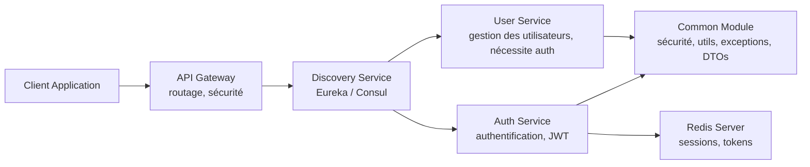
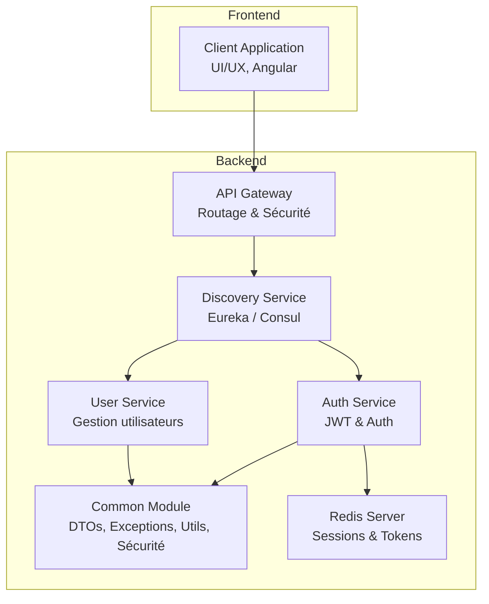

# Solidstack

[](https://github.com/mazemzemi/soldstack/actions/workflows/ci.yml)


---

## 📌 Description

**Solidstack** est un projet basé sur une **architecture Clean** et **microservices**, conçu pour fournir une plateforme modulable, maintenable et extensible.  
Le projet respecte les principes **SOLID** et les bonnes pratiques de **craftsmanship**.

### Fonctionnalités principales
- ✅ Architecture multi-modules claire (`auth-service`, `user-service`, `gateway-service`, `discovery-service`, `common`)
- ✅ Sécurité basée sur **JWT** (Token-Based Authentication)
- ✅ Intégration de **Redis** pour la gestion de sessions et du cache
- ✅ Conteneurisation avec **Docker** et orchestration avec **Docker Compose**
- ✅ Gestion des dépendances avec **Gradle**

---

## 🏗️ Architecture

Le projet suit les principes de **Clean Architecture**, chaque service étant indépendant et exposant des API REST.

### 📊 Diagramme des microservices



---

## 📂 Arborescence du projet

```text
solidstack/
│
├── ⚙️ backend/
│   ├── 📦 common/            # Code partagé (🔒 sécurité, 🛠️ utils, ⚠️ exceptions, 📑 DTOs)
│   ├── 🔑 auth-service/      # Authentification et génération de tokens
│   ├── 👤 user-service/      # Gestion des utilisateurs
│   ├── 🌐 gateway-service/   # API Gateway (routage, sécurité)
│   └── 🧭 discovery-service/ # Service de découverte (Eureka / Consul)
│
└── 🎨 frontend/             # Application front (UI/UX, Angular)
```

---

## ⚙️ Prérequis

- [Java 24](https://openjdk.org/projects/jdk/24/)
- [Spring Boot 3.5.6](https://spring.io/projects/spring-boot)
- [Angular 20](https://angular.io/)
- [Gradle 9.1.0](https://gradle.org/)
- [Docker](https://www.docker.com/)
- [Docker Compose](https://docs.docker.com/compose/)
- [Redis](https://redis.io/)

---

## 🚀 Démarrage rapide

### 1. Cloner le projet
```bash
git clone https://github.com/mazemzemi/soldstack.git
cd soldstack
```

### 2. Construire les services
```bash
./gradlew clean build
```

### 3. Lancer avec Docker Compose
```bash
docker-compose up --build
```

---

## 🧪 Tests

Les tests unitaires utilisent **JUnit 5** et **Mockito**.

### Lancer les tests
```bash
./gradlew test
```

---

## 🔑 Usage API

Le projet expose des endpoints via le **Gateway** :

| Service      | Endpoint                | Description                                    |
| ------------ | ---------------------- | ---------------------------------------------- |
| Auth Service | `POST /auth/register`   | Inscription d’un utilisateur                   |
| Auth Service | `POST /auth/login`      | Connexion et génération de JWT                 |
| Auth Service | `POST /auth/logout`     | Déconnexion (auth requis)                      |
| Auth Service | `POST /auth/me`         | Utilisateur actuellement authentifié (auth requis) |
| User Service | `GET /users`            | Liste des utilisateurs (auth requis)          |
| User Service | `POST /users`           | Ajouter un utilisateur (auth requis)          |
| User Service | `GET /users/{id}`       | Détails d’un utilisateur (auth requis)        |
| User Service | `DELETE /users/{id}`    | Supprimer un utilisateur (auth requis)        |

> Tous les endpoints sont sécurisés par **JWT**, sauf l’inscription et la connexion.

---

## 🖥️ Architecture globale : Frontend ↔ Backend ↔ Microservices



### 🔹 Explications rapides

- **Client Application** : Interface utilisateur, communique uniquement avec le **Gateway**.
- **API Gateway** : Point d’entrée unique, routage vers les microservices, filtre les requêtes via JWT.
- **Discovery Service** : Permet au Gateway et aux services de se découvrir dynamiquement.
- **Auth Service** : Gestion des inscriptions, connexions, tokens JWT.
- **User Service** : Gestion des utilisateurs, endpoints sécurisés.
- **Common Module** : Contient les utilitaires, DTOs et règles de sécurité partagés.
- **Redis** : Stockage des sessions et tokens pour Auth Service.

---

## 📦 CI/CD

La pipeline GitHub Actions est disponible dans `.github/workflows/ci.yml` :
- ✅ Build & tests unitaires
- ✅ Vérification de la qualité du code
- ✅ Publication des images Docker

---

## 🛠️ Technologies principales

- **Langage** : Java 24
- **Framework back-end** : Spring Boot 3.5.6
- **Framework front-end** : Angular 20
- **Authentification** : JWT + Spring Security
- **Base de données** : Base en mémoire (H2 / tests)
- **Cache** : Redis
- **Orchestration** : Docker & Docker Compose

---

#### 👨‍💻 Auteur

Développé par [Mohamed Ali Zemzemi](https://www.linkedin.com/in/mohamed-ali-zemzemi-98a9b01b/).

